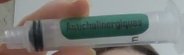

# Détection automatique d’étiquettes médicamenteuses sur des seringues 💉

Ce projet vise à réduire les erreurs médicamenteuses dans le milieu hospitalier en automatisant la détection des seringues et l’identification des étiquettes de médicaments à l’aide de la vision par ordinateur.  
Grâce à un modèle **YOLOv8** et des algorithmes de segmentation, reconnaissance de couleur et OCR, le système détecte automatiquement la seringue, identifie la couleur de son étiquette (indiquant la famille du médicament) et extrait le texte présent.

Ce projet a été développé dans le cadre du cours *Compréhension de l’image* à l’École de Technologie Supérieure (ÉTS), sous la supervision de Luc Duong, par Katia Kaci et Alejandro Olivares Hernandez.

## Objectifs

- Détecter automatiquement une seringue dans une image
- Segmenter et identifier l’étiquette collée sur la seringue
- Déterminer la couleur dominante de l’étiquette (pour identifier la famille de médicament)
- Extraire le texte de l’étiquette (nom du médicament) grâce à *Tesseract OCR*
- Fournir un système rapide, fiable et applicable en temps réel

## Méthodologie

### 1. **Annotation**
- **LabelImg** pour annoter les seringues (boîtes englobantes `.txt`).
- **LabelMe** pour la segmentation précise des étiquettes (fichiers `.json`).
- Conversion vers le format YOLO avec **labelme2yolo**.

### 2. **Entraînement YOLOv8**
- Entraînement sur **233 images** (200 pour l’entraînement, 33 pour la validation).
- Comparaison de plusieurs modèles : `YOLOv8n`, `YOLOv8s`, `YOLOv8m`, `YOLOv8l`, `YOLOv8x`.
- Application d’**autoaugmentation**, **rotation jusqu’à 90°**, et **Mosaic Augmentation** pour accroître la robustesse.

### 3. **Segmentation et détection**
- Utilisation de **YOLOv8s** comme modèle optimal pour la précision et la rapidité.
- Détection des seringues et segmentation de l’étiquette sur l’image.

### 4. **Détection de couleur**
- Conversion des images segmentées en espace **HSB (Hue, Saturation, Brightness)** avec OpenCV.
- Calcul des moyennes de teinte et classification selon des intervalles prédéfinis (basé sur *Fleyeh, 2004*).

### 5. **Reconnaissance de texte (OCR)**
- Utilisation de **Tesseract OCR**.
- Prétraitement : niveaux de gris → seuillage Otsu → inversion binaire → dilatation.
- Nettoyage du texte et export vers fichiers `.txt`.

## Démonstration en direct

Une démo en live vidéo a été réalisée pour tester le système en conditions réelles.  
Lorsqu’une seringue était placée devant la caméra, une photo était capturée automatiquement, nommée selon la date et l’heure précises de la prise.  
Cette automatisation simule un scénario hospitalier où chaque injection peut être archivée avec un horodatage exact pour assurer la traçabilité des médicaments.

### Exemple de résultat capturé en temps réel

  

## Technologies utilisées

| Domaine | Outils / Librairies |
|----------|--------------------|
| Détection d’objets | [YOLOv8 (Ultralytics)](https://docs.ultralytics.com/models/yolov8/) |
| Annotation | LabelImg, LabelMe |
| Vision par ordinateur | OpenCV |
| Reconnaissance de texte | Tesseract OCR |
| Conversion de formats | labelme2yolo |
| Langage | Python 3.10 |

## Améliorations futures

- Augmenter la taille du dataset (>500 images).
- Exclure les pixels noirs lors du calcul de teinte.
- Optimiser les intervalles de classification de couleur.
- Tester des modèles OCR plus robustes pour images de faible qualité.
- Intégration sur un système embarqué (caméra hospitalière ou application mobile temps réel).
